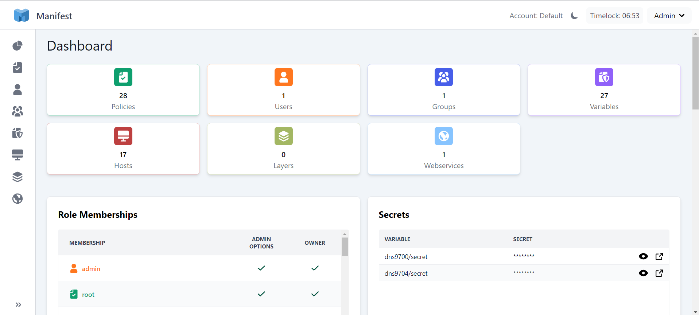

# Welcome to Manifest

Manifest is an open-source platform that provides an alternative user interface for Conjur services.



## Table of Contents

1. [Introduction](#welcome-to-manifest)
2. [Installing and Running Manifest](#installing-and-running-manifest)
   - [Install Local Manifest with Docker](#1-install-local-manifest-with-docker)
   - [Install Manifest on Kubernetes Cluster](#2-install-manifest-on-kubernetes-cluster)
     - [Install Kubernetes (K8s)](#21-install-kubernetes-k8s)
     - [K8s + Manifest + Conjur Open Source Environment](#22-k8s--manifest--conjur-open-source-environment)
     - [K8s + Manifest + Config your Existing Conjur K8s Setup](#23-k8s--manifest--your-existing-conjur-kubernetes-setup)
3. [Values.yaml documentation](#values-yaml-documentation)

## Installing and Running Manifest

There are two ways to start using Manifest:

- **with Docker**: See the [Local Installation Guide](#1-install-local-manifest-with-docker)
- **with Kubernetes**: See the [Kubernetes Installation Guides](#2-install-manifest-on-kubernetes-cluster)

## 1. Install Local Manifest with Docker

> **NOTE:** Before you begin, ensure you have the following prerequisites:
>
> - [Docker](https://docs.docker.com/get-docker/)
> - [Docker-Compose](https://docs.docker.com/compose/install/)

1. Clone this project repository.
2. Navigate to the repository folder:
   ```bash
   cd conjur-tooling
   ```
3. Start the Docker container:
   ```bash
   docker compose up -d
   ```
   **Verification:** The terminal returns:
   ```bash
   [+] Running 7/8
   ✔ Network conjur              Created
   ✔ Container bot_app           Created
   ✔ Container conjur-pgadmin-1  Created
   ✔ Container postgres_database Created
   ✔ Container openssl           Created
   ✔ Container conjur_server     Created
   ✔ Container nginx_proxy       Created
   ✔ Container conjur_client     Created
   ```
4. Create an account named `default`:
   ```bash
   docker exec conjur_server conjurctl account create default > admin-data
   ```
   **Verification:** The terminal returns:
   ```bash
   Created new account 'default'
   ```
5. Connect the Conjur client to the Conjur server:
   ```bash
   docker exec -it conjur_client conjur init -u https://proxy -a default --self-signed
   ```
   **Verification:** The terminal returns:
   ```bash
   Wrote certificate to /root/conjur-server.pem
   Wrote configuration to /root/.conjurrc
   ```
6. Log in as the `admin` user using the API key from `conjur-tooling/admin-data`:
   ```bash
   docker exec conjur_client conjur login -i admin -p {api-key}
   ```
   **Verification:** The terminal returns:
   ```bash
   Logged in
   ```
7. Set your own admin password:
   ```bash
   docker exec conjur_client conjur user change-password -p CONJUR_password1
   ```
   **Verification:** The terminal returns:
   ```bash
   Password changed
   ```
8. Rename the `.env.example` file to `.env` and set up your own variables or use the default values.

> **IMPORTANT:** If running Conjur locally, set `NODE_TLS_REJECT_UNAUTHORIZED` to 0 in your environment.

| **Setup for Developers**                         | **Setup for Users**                              |
| ------------------------------------------------ | ------------------------------------------------ |
| 9. Install project dependencies:                 | 9. Install project dependencies:                 |
| `pnpm install`                                   | `pnpm install`                                   |
| 10. Start a development server:                  | 10. Create a production version of Manifest App: |
| `pnpm run dev`                                   | `pnpm run build`                                 |
| 11. Open the local URL provided by the terminal. | 11. Run Manifest App:                            |
|                                                  | `pnpm run preview`                               |

> **IMPORTANT:** Ensure the Nginx_proxy Container is running. Check the Conjur Server at https://localhost:8443.

To log in, use:

- **Account Name:** `default`
- **Username:** `admin`
- **Password:** `CONJUR_password1`

For Developers **IMPORTANT:** [Enhance Your Development Experience with Recommended VS Code Extensions](#enhance-your-development-experience-with-recommended-vs-code-extensions)

## 2. Install Manifest on Kubernetes Cluster

### 2.1. Install Kubernetes (K8s)

> **NOTE:** Ensure you have the following prerequisites:
>
> 1. [Helm](https://helm.sh/docs/intro/install/#through-package-managers)
> 2. [kubectl](https://kubernetes.io/docs/tasks/tools/install-kubectl/)
> 3. Set up a Kubernetes cluster and persistent volume.

### 2.2. K8s + Manifest + Conjur Open Source Environment

> **NOTE:** If using Windows, ensure bash is installed. See [how to install and run bash](https://www.makeuseof.com/windows-11-install-run-bash/).

1. Install `kubectl` and `helm`:
   ```bash
   sudo snap install kubectl --classic
   sudo snap install helm
   ```
2. Install Docker:
   ```bash
   sudo snap install docker
   ```
   [Docker installation guide](https://docs.docker.com/engine/install/ubuntu/)
3. Install Conjur OSS Helm Chart:
   ```bash
   CONJUR_NAMESPACE=conjur
   kubectl create namespace "$CONJUR_NAMESPACE"
   DATA_KEY="$(docker run --rm cyberark/conjur data-key generate)"
   HELM_RELEASE=conjur-oss
   VERSION=2.0.7
   helm install \
     -n "$CONJUR_NAMESPACE" \
     --set dataKey="$DATA_KEY" \
     --set account.create=true \
     --set image.tag=1.20.0-4262 \
     "$HELM_RELEASE" \
     https://github.com/cyberark/conjur-oss-helm-chart/releases/download/v$VERSION/conjur-oss-$VERSION.tgz
   ```
   **Verification:** The terminal returns:
   ```bash
   NAME: conjur-oss
   NAMESPACE: conjur
   STATUS: deployed
   ```
4. Retrieve the admin API key:
   ```bash
   CONJUR_ACCOUNT=default
   POD_NAME=$(kubectl get pods --namespace "$CONJUR_NAMESPACE" \
             -l "app=conjur-oss,release=$HELM_RELEASE" \
             -o jsonpath="{.items[0].metadata.name}")
   kubectl exec --namespace "$CONJUR_NAMESPACE" \
             "$POD_NAME" \
             --container=conjur-oss \
             -- conjurctl role retrieve-key "$CONJUR_ACCOUNT":user:admin | tail -1
   ```

### 2.3. K8s + Manifest + Your Existing Conjur Kubernetes Setup

> **NOTE:** Ensure you have the following prerequisites:
>
> - [Conjur OSS](https://github.com/cyberark/conjur-oss-helm-chart/tree/main/conjur-oss/) (version 1.20.0-4262 or later)
> - Conjur Authn authentication.

1. Create a folder named `manifest` and navigate to it:
   ```bash
   mkdir manifest
   cd manifest
   ```
2. Generate the `values.yaml` file:
   ```bash
   helm show values oci://ghcr.io/codefactoryhu/manifest-chart > values.yaml
   ```
   **Verification:** The terminal returns:
   ```bash
   Pulled: ghcr.io/codefactoryhu/manifest-chart:0.1.1
   Digest: sha256:95c9fc48212a38f6296b7a757e85de6b82233cb6a2719c8d010285f1dcf5aa6c
   ```
3. Deploy Manifest:
   ```bash
   helm install manifest oci://ghcr.io/codefactoryhu/manifest-chart -n <conjur-namespace> -f values.yaml
   ```
4. Get pod name:

   ```bash
   kubectl get pods -n <conjur-namespace>
   ```

5. Access the running pod:

   ```bash
   kubectl exec -it <manifest_pod> -n <conjur-namespace> /bin/sh
   ```

6. Check all containers are running:
   ```bash
   kubectl get all -n <conjur-namespace>
   ```
7. Open your browser and visit the deployed Manifest application:
   ```bash
   http://<service-ip>:3000
   ```

## Enhance Your Development Experience with Recommended VS Code Extensions

To streamline your development workflow, we recommend the following Visual Studio Code extensions:

1. [Svelte for VS Code](https://marketplace.visualstudio.com/items?itemName=svelte.svelte-vscode)
2. [Tailwind CSS IntelliSense](https://marketplace.visualstudio.com/items?itemName=bradlc.vscode-tailwindcss)
3. [JavaScript and TypeScript Nightly](https://marketplace.visualstudio.com/items?itemName=ms-vscode.vscode-typescript-next)
4. [ESLint](https://marketplace.visualstudio.com/items?itemName=dbaeumer.vscode-eslint)
5. [Prettier ESLint](https://marketplace.visualstudio.com/items?itemName=rvest.vs-code-prettier-eslint)
6. [Prettier - Code formatter](https://marketplace.visualstudio.com/items?itemName=esbenp.prettier-vscode)
7. [Conventional Commits](https://marketplace.visualstudio.com/items?itemName=vivaxy.vscode-conventional-commits)

When you open this project in Visual Studio Code, you may be prompted to install these recommended extensions. We encourage you to accept this recommendation to optimize your coding experience.

## Enjoy Your Secure and Easy-to-Use Conjur Interface with Manifest!

## Values yaml Documentation

| Key                 | Type    | Default                       | Description                                                                  |
| ------------------- | ------- | ----------------------------- | ---------------------------------------------------------------------------- |
| conjurApiUrl        | string  | <https://conjur-oss>          | The Conjur API URL that's accessible within the namespace                    |
| httpSecureCookie    | boolean | false                         | Wether or not the to use secure cookies on Manifest                          |
| conjurTlsSecretName | string  | conjur-oss-conjur-ssl-ca-cert | The name of the TLS secret that contains the certificate the Conjur API uses |
